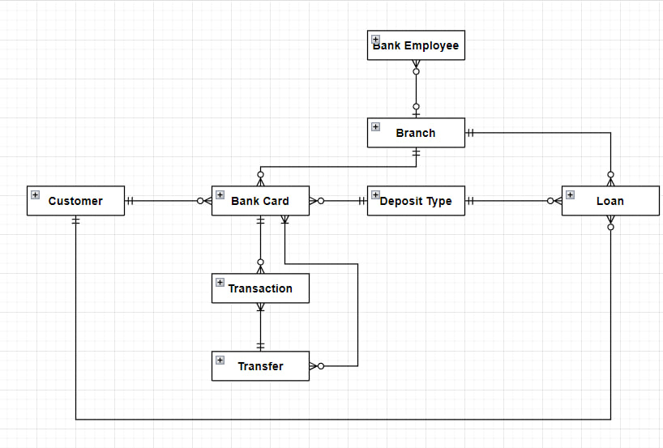

# Description

Project of Yang Chenran

Bank database system

tables.sql - Creation of tables

triggers.sql - Required triggers

procedures.sql - Procedures

simple_CRUD.sql - Simple create, read, update and delete operations

insert_data.sql - Data to be inserted

select.sql - Examples of select statements

views.sql - Examples of views

# E-R Diagram

# Tables

## Customer Table

| Column Name | Description                                                  | Data Type           |
| ----------- | ------------------------------------------------------------ | ------------------- |
| id          | Unique identifier for the customer                           | SERIAL              |
| name        | Customer's name                                              | VARCHAR(100)        |
| pid         | Personal identification number of the customer, unique for each customer | VARCHAR(100) UNIQUE |

## Deposit Type Table

| Column Name   | Description                                                | Data Type                 |
| ------------- | ---------------------------------------------------------- | ------------------------- |
| id            | Unique identifier for the deposit type                     | SERIAL                    |
| type_name     | Name of the deposit type                                   | VARCHAR(100)              |
| interest_rate | Interest rate for the deposit type, expressed as a decimal | DECIMAL(4, 2) DEFAULT 0.0 |
| description   | Description of the deposit type                            | VARCHAR(100)              |

## Branch Table

| Column Name | Description                                                  | Data Type                  |
| ----------- | ------------------------------------------------------------ | -------------------------- |
| id          | Unique identifier for the branch                             | SERIAL                     |
| name        | Name of the branch                                           | VARCHAR(100)               |
| address     | Address of the branch                                        | VARCHAR(100)               |
| email       | Email address of the branch, unique for each branch          | VARCHAR(100) UNIQUE        |
| month_cost  | Monthly cost of operating the branch, expressed as a decimal | DECIMAL(12, 2) DEFAULT 0.0 |

## Bank Card Table

| Column Name     | Description                                              | Data Type                           |
| --------------- | -------------------------------------------------------- | ----------------------------------- |
| id              | Unique identifier for the bank card                      | SERIAL                              |
| card_number     | Card number of the bank card, unique for each card       | VARCHAR(20) UNIQUE                  |
| balance         | Current balance of the bank card, expressed as a decimal | DECIMAL(12, 2) DEFAULT 0.0          |
| customer_id     | Foreign key referencing the customer table               | INTEGER REFERENCES customer(id)     |
| deposit_type_id | Foreign key referencing the deposit type table           | INTEGER REFERENCES deposit_type(id) |
| branch_id       | Foreign key referencing the branch table                 | INTEGER REFERENCES branch(id)       |

## Transfer Table

| Column Name      | Description                                                  | Data Type                        |
| ---------------- | ------------------------------------------------------------ | -------------------------------- |
| id               | Unique identifier for the transfer                           | SERIAL                           |
| amount           | Amount transferred, expressed as a decimal                   | DECIMAL(12, 2)                   |
| sender_card_id   | Foreign key referencing the bank card table for the sender   | INTEGER REFERENCES bank_card(id) |
| receiver_card_id | Foreign key referencing the bank card table for the receiver | INTEGER REFERENCES bank_card(id) |
| transfer_date    | Date and time of the transfer                                | TIMESTAMP NOT NULL               |

## Transaction Table

| Column Name      | Description                                       | Data Type                        |
| ---------------- | ------------------------------------------------- | -------------------------------- |
| id               | Unique identifier for the transaction             | SERIAL                           |
| bank_card_id     | Foreign key referencing the bank card table       | INTEGER REFERENCES bank_card(id) |
| branch_id        | Foreign key referencing the branch table          | INTEGER REFERENCES branch(id)    |
| transfer_id      | Foreign key referencing the transfer table        | INTEGER REFERENCES transfer(id)  |
| amount           | Amount of the transaction, expressed as a decimal | DECIMAL(12, 2)                   |
| transaction_date | Date and time of the transaction                  | TIMESTAMP NOT NULL               |

## Bank Employee Table

| Column Name | Description                                                  | Data Type                     |
| ----------- | ------------------------------------------------------------ | ----------------------------- |
| id          | Unique identifier for the bank employee                      | SERIAL                        |
| name        | Employee's name                                              | VARCHAR(100)                  |
| pid         | Personal identification number of the employee, unique for each employee | VARCHAR(100) UNIQUE           |
| branch_id   | Foreign key referencing the branch table                     | INTEGER REFERENCES branch(id) |
| email       | Email address of the employee, unique for each employee      | VARCHAR(100) UNIQUE           |
| salary      | Salary of the employee, expressed as a decimal               | DECIMAL(12, 2) DEFAULT 2000   |

## Loan Table

| Column Name     | Description                                                  | Data Type                                        |
| --------------- | ------------------------------------------------------------ | ------------------------------------------------ |
| id              | Unique identifier for the loan                               | SERIAL                                           |
| amount          | Amount of the loan, expressed as a decimal                   | DECIMAL(12, 2)                                   |
| deposit_type_id | Foreign key referencing the deposit type table               | INTEGER REFERENCES deposit_type(id)              |
| branch_id       | Foreign key referencing the branch table                     | INTEGER REFERENCES branch(id)                    |
| customer_id     | Foreign key referencing the customer table                   | INTEGER REFERENCES customer(id)                  |
| loan_start_date | Start date of the loan                                       | TIMESTAMP NOT NULL                               |
| loan_end_date   | End date of the loan, default value is set to '9999-12-31 23:59:59' | TIMESTAMP NOT NULL DEFAULT '9999-12-31 23:59:59' |

